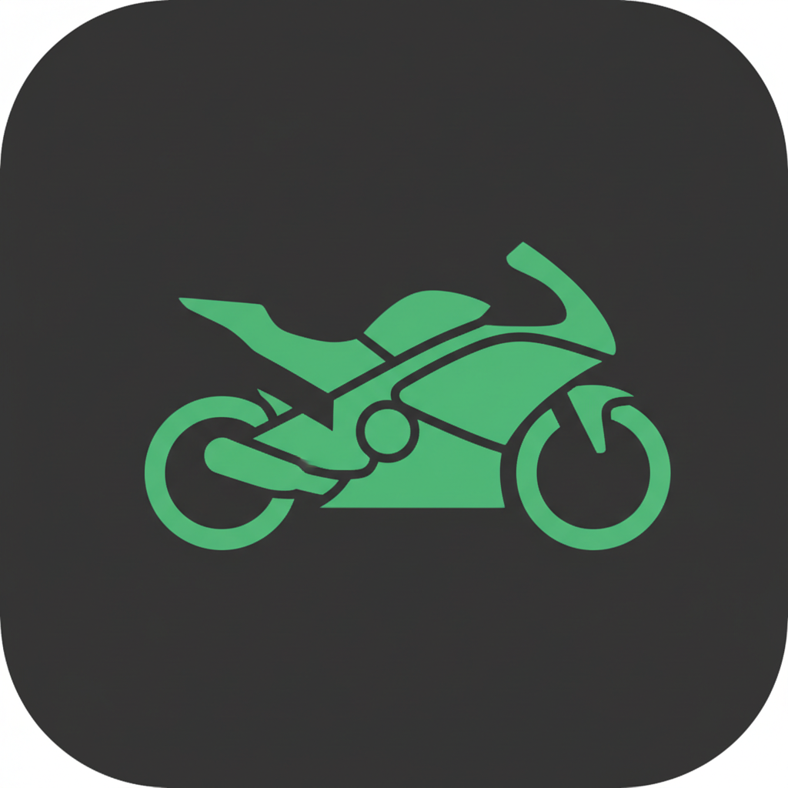

# 🛵 MotoTaxi App

Aplicación de transporte en moto con geolocalización en tiempo real, chat entre usuarios, sistema de reseñas y botón de emergencia SOS.



## ✨ Características

- 🔐 **Autenticación** - Login y registro con número de teléfono
- 🗺️ **Mapa en tiempo real** - Geolocalización con Leaflet
- 💬 **Chat** - Mensajería entre pasajeros y conductores
- ⭐ **Reseñas** - Sistema de calificaciones
- 🚨 **Botón SOS** - Alerta de emergencia
- 📱 **PWA** - Funciona como app nativa en móviles

## 🚀 Desplegar en Cloudflare Pages

### Paso 1: Subir a GitHub

```bash
# Clona o crea el repo
git init
git add .
git commit -m "Initial commit"
git branch -M main
git remote add origin https://github.com/TU_USUARIO/moto-taxi-app.git
git push -u origin main
```

### Paso 2: Conectar a Cloudflare Pages

1. Ve a [dash.cloudflare.com](https://dash.cloudflare.com)
2. Click en **"Pages"** en el menú lateral
3. Click en **"Create a project"**
4. Selecciona **"Connect to Git"**
5. Autoriza Cloudflare a acceder a tu GitHub
6. Selecciona el repositorio `moto-taxi-app`

### Paso 3: Configuración de Build

| Configuración | Valor |
|--------------|-------|
| **Framework preset** | `Vite` |
| **Build command** | `npm run build` |
| **Build output directory** | `dist` |

Click en **"Save and Deploy"**

### Paso 4: Configurar Dominio (Opcional)

1. En tu proyecto de Cloudflare Pages, ve a **"Custom domains"**
2. Agrega tu dominio o usa el `.pages.dev` gratuito

## 🛠️ Desarrollo Local

```bash
# Instalar dependencias
npm install

# Iniciar servidor de desarrollo
npm run dev

# Construir para producción
npm run build
```

## 📁 Estructura del Proyecto

```
├── public/           # Archivos estáticos (iconos, manifest)
├── src/
│   ├── components/   # Componentes React
│   ├── hooks/        # Custom hooks (useAppStore)
│   ├── types/        # TypeScript types
│   ├── App.tsx       # Componente principal
│   └── main.tsx      # Entry point
├── dist/             # Build output (generado)
├── _redirects        # Configuración de rutas SPA
├── wrangler.toml     # Configuración de Cloudflare
└── vite.config.ts    # Configuración de Vite
```

## 🌐 Backend (Opcional)

Actualmente la app usa **datos simulados** (mock data) que funcionan perfectamente para demo.

Para agregar backend real con Cloudflare:

- **Cloudflare D1** - Base de datos SQLite serverless
- **Cloudflare Workers** - API serverless
- **Firebase** - Alternativa fácil y gratuita

## 📱 Uso de la App

1. Abre la app en tu móvil
2. Ingresa cualquier número de teléfono
3. Si es nuevo, elige tu rol (Pasajero o Conductor)
4. Ve conductores/pasajeros cercanos en el mapa
5. Toca un marcador para ver perfil y contactar

## 🎨 Tecnologías

- **React 18** + **TypeScript**
- **Vite** - Build tool
- **Tailwind CSS** + **shadcn/ui**
- **Leaflet** - Mapas
- **Lucide React** - Iconos

## 📄 Licencia

MIT - Libre para usar y modificar.

---

**Desplegado con ❤️ en Cloudflare Pages**
